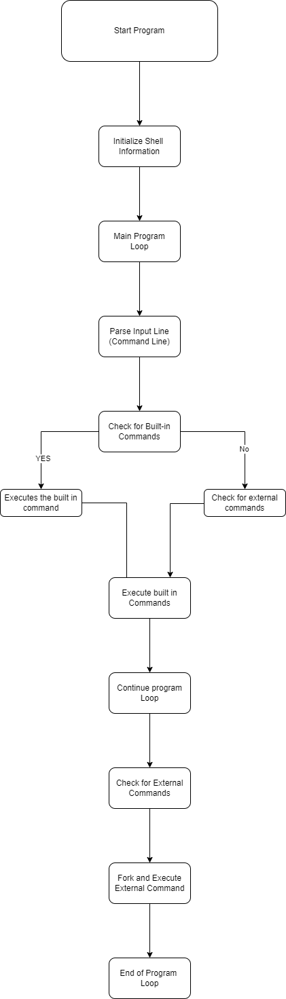

# Simple Shell

This is a simple shell implementation created by Tarek and Mehdi.

This project implements a basic shell program in C. It provides functionalities similar to those found in typical Unix shells, such as executing commands, handling input/output redirection, and supporting built-in commands.

## Features

Command execution
Input/output redirection
Built-in commands
Command chaining
Functions
Shell Functions
**hsh(info_t *, char ): Main function responsible for initiating the shell.
find_builtin(info_t *): Function to find if a command is a built-in command.
find_cmd(info_t *): Function to find and execute external commands.
fork_cmd(info_t *): Function to fork and execute commands.
Path Functions
is_cmd(info_t *, char *): Function to check if a command exists in the system path.
dup_chars(char *, int, int): Function to duplicate a portion of a string.
find_path(info_t *, char *, char *): Function to find the full path of a command.
Input/Output Functions
_eputs(char *): Function to print error messages.
_eputchar(char): Function to print a character to stderr.
_putfd(char, int): Function to write a character to a file descriptor.
_putsfd(char *, int): Function to write a string to a file descriptor.
String Functions
_strlen(char *): Function to calculate the length of a string.
_strcmp(char *, char *): Function to compare two strings.
starts_with(const char *, const char *): Function to check if a string starts with a given prefix.
_strcat(char *, char *): Function to concatenate two strings.
Memory Functions
_memset(char *, char, unsigned int): Function to fill a block of memory with a specific value.
**ffree(char ): Function to free memory allocated by dynamic arrays.
_realloc(void *, unsigned int, unsigned int): Function to reallocate memory for a dynamic array.
Usage
To use this shell, compile the provided source files and run the executable. Then, you can type commands just like in a regular shell environment.

## Installation


\
**Clone this repository**\
\
``git clone https://github.com/TarekzainAldin/holbertonschool-simple_shell.git``\
\

Compile the source files using your prefered C compiler.
Run the generated executable.
Requirements
This project requires a C compiler that supports the C99 standard.

## How to use


Open a terminal and execute the following :

``./shell``
## Contributing

Contributions are welcome!
Feel free to submit bug reports, feature requests, or pull requests through the project repository.


## Features

### List of features
```
Command execution
Input/output redirection
Built-in commands
Command chaining
```
## Functions

### List of Functions
```
Shell Functions
**hsh(info_t *, char ): Main function responsible for initiating the shell.
find_builtin(info_t *): Function to find if a command is a built-in command.
find_cmd(info_t *): Function to find and execute external commands.
fork_cmd(info_t *): Function to fork and execute commands.
```
## Path

```
is_cmd(info_t *, char *): Function to check if a command exists in the system path.
dup_chars(char *, int, int): Function to duplicate a portion of a string.
find_path(info_t *, char *, char *): Function to find the full path of a command.

```
## Input/Output Functions

```
_eputs(char *): Function to print error messages.
_eputchar(char): Function to print a character to stderr.
_putfd(char, int): Function to write a character to a file descriptor.
_putsfd(char *, int): Function to write a string to a file descriptor.

```
## String Functions

```
_strlen(char *): Function to calculate the length of a string.
_strcmp(char *, char *): Function to compare two strings.
starts_with(const char *, const char *): Function to check if a string starts with a given prefix.
_strcat(char *, char *): Function to concatenate two strings.

```
## Memory Functions

```
_memset(char *, char, unsigned int): Function to fill a block of memory with a specific value.
**ffree(char ): Function to free memory allocated by dynamic arrays.
_realloc(void *, unsigned int, unsigned int): Function to reallocate memory for a dynamic array.


```
## Usage

```
To use this shell, compile the provided source files and run the executable. Then, you can type commands just like in a regular shell environment.

```
## Code exemple


```
#include "shell.h"

int main() {
    // Initialize shell information
    info_t shell_info = INFO_INIT;

    // Start the shell
    hsh(&shell_info, NULL);

    return 0;
}

```
```

## Screenshots





```
## Flowchart Explanation
```
Initialization: The program initializes the shell environment.
Main Program Loop: The program enters the main loop to continually process user input.
Read Input Line: It reads input from the user.
Parse Input Line: The input line (command line) is parsed to identify individual commands and arguments.
Check for Built-in Commands: It checks if the input corresponds to a built-in command.
If yes, it executes the built-in command.
If no, it proceeds to check for external commands.
Execute Built-in Commands: If the command is built-in, the program executes it.
Continue Program Loop: After executing the command (if it was built-in), the program continues to the next iteration of the loop.
Check for External Commands: If the command is not built-in, the program checks if it corresponds to an external command.
If yes, it forks a new process and executes the external command.
Fork and Execute External Command: The program forks a new process and executes the external command in the child process.
Continue Program Loop: After executing the external command, the program continues to the next iteration of the loop.
End of Program Loop: When the user decides to exit the shell or an error occurs, the program exits the main loop.
End Program: The program terminates.
This flowchart illustrates the flow of control within the simple shell program, detailing each step of the process from initialization to termination

```
